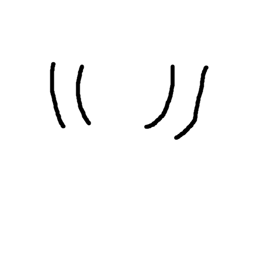

# QuotesBot 
 (yes i drew that in ms-paint, no i'm not sorry)

## About

QuotesBot is a simple Discord bot, allowing the user to add the bot to a server and, after setup, record quotes from users in the server.
The bot has commands to send these quotes as a text file and to clear all quotes and the selected channel.

The bot follows a specific Regex for all quotes. The Regex is as follows:

Usage for C#: 
```csharp
    Regex DoubleQuoteRegex = new Regex("\"(?:[^\"]|\"\")*\"\\s+-\\s+[A-Za-z\\s0-9]+", RegexOptions.IgnoreCase);
    Regex SingleQuoteRegex = new Regex("'(?:[^']|'')*'\\s+-\\s+[A-Za-z\\s0-9]+", RegexOptions.IgnoreCase);
```

Usage Elsewhere: `"(?:[^"]|"")*"\s+-\s+[A-Za-z0-9]+` or `'(?:[^']|'')*'\s+-\s+[A-Za-z0-9]+`

This Regex will match any quote that is surrounded by double quotes, followed by a space, a dash, and a space, followed by any number of letters or numbers.
For Example, `"This is a quote" - User` or `'This is also a quote' - User 2022` will match, but `"This is a quote' - User` will not.

The Bot is written in C# using the Discord.Net library.

---
## Features/Commands
- ### `/register channel`
The register command uses one argument, a channel.

It is used to setup the quotes channel of the current guild, and will create a `{Guild.Id}.json` file in the `./GuildQuotes` directory.
Upon creation, it will attempt to load as many quotes from the channel as possible.

You can re-use the command with a different channel arg to change the channel.

- ### `/reset`
The reset command is used to clear the `ChannelId` and quotes from the current guild's `.json` file.

It does not reset the `ChannelId` afterwards, so you must reset it with `/register`

- ### `/totextfile bool`
The `totextfile` command uses one argument, a boolean (true/false).

It gets all the quotes of the current guild and puts them into a text file which is sent into the guild channel.
This text file is shortly deleted from the system after it is sent.

The bool argument sends the message as ephemeral if it is set to true, meaning the message can only be seen by the command author.
 

---
## Setup

Setup with the bot is easy. The bot looks for a certain `Bot.json` File in the `.exe`'s containing directory.
If the file is not found, it will request a user input of the bot's token. 

If you don't have a bot setup through the [Discord Developer Portal](https://discord.com/developers/applications/),
you can setup the bot there and get the bot token from the `Bot` section of your application.

Just paste it in and hit enter and the program will write it to a .json file. 
Then, it will create a `GuildQuotes` directory, if it doesn't already exist.

Now, your bot is online, and all you need to do is add it to your server with the following permissions (or `Administrator`):
```
View Channels
Send Messages
Embed Links
Attach Files
Manage Messages
Manage Threads
Read Message History
Use Application Commands
```
Once done, in the server you have added the bot to, run the `/register` command with the channel you want to set as your quotes channel.

And that's it. If the embed returns as green and reads success, your bot is setup and will read as many quotes as it can from the channel.

---
## License

### This Module is Licensed Under A Modified Version of the [CC-BY-NC-SA 4.0](http://creativecommons.org/licenses/by-nc-sa/4.0/) License. A Copy of the License is Found [Here](https://github.com/ASPNyan/quotesbot/blob/main/LICENSE.md).

<a rel="license" href="http://creativecommons.org/licenses/by-nc-sa/4.0/"></a>

The following is a human-readable summary of (and not a substitute for) the license.

**--Start--**

#### You are free to:

- **Share** — copy and redistribute the material in any medium or format
- **Adapt** — remix, transform, and build upon the material

- The licensor cannot revoke these freedoms as long as you follow the license terms.

---

#### Under the following terms:

- **Attribution** — You must give [appropriate credit](#), provide a link to the license, and [indicate if changes were made](#). You may do so in any reasonable manner, but not in any way that suggests the licensor endorses you or your use.
- **NonCommercial** — You may not use the material for [commercial purposes](#).
- **ShareAlike** — If you remix, transform, or build upon the material, you must distribute your contributions under the [same license](#) as the original.

- **No additional restrictions** — You may not apply legal terms or [technological measures](#) that legally restrict others from doing anything the license permits.

---

#### Notices:

- You do not have to comply with the license for elements of the material in the public domain or where your use is permitted by an applicable [exception or limitation](#).
- No warranties are given. The license may not give you all of the permissions necessary for your intended use. For example, other rights such as [publicity, privacy, or moral rights](#) may limit how you use the material.

**--End--**

To Contact Me About Commercial Use, You Can DM Me on Discord @ `ASP Nyan#1169` (User ID: `387139715301769216`).